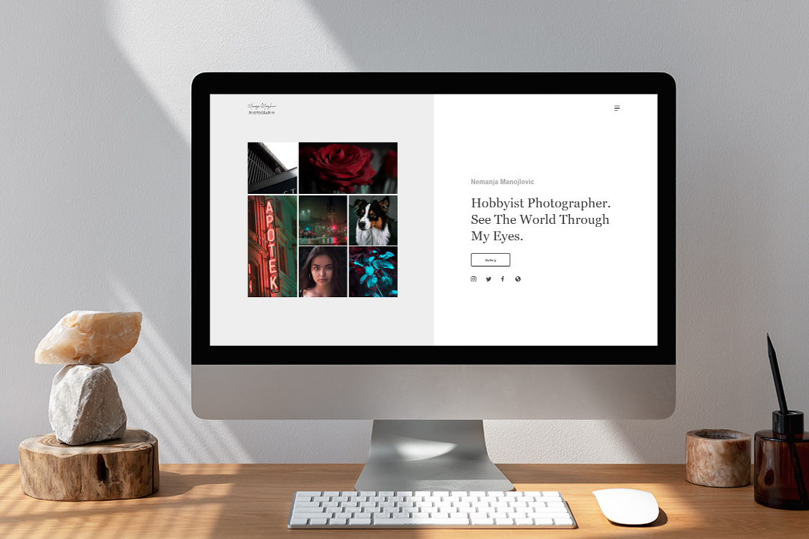
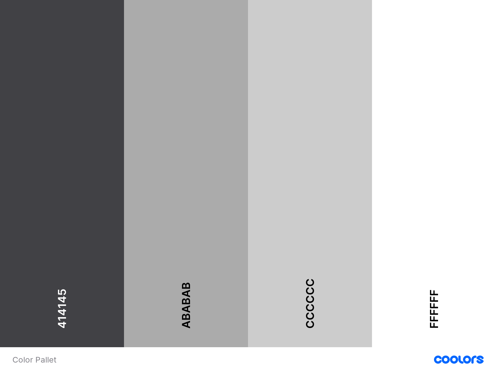

<h1 align="center"> Nemanja Manojlovic Photography Portfolio </h1>

This project is a photography portfolio website. The incentive for the project creation is my hobby, photography.
The portfolio website features my work to the general public. Therefore, UI/UX is not group-specific but rather aimed towards everyone interested in seeing my work.

<h2 align="center"> </h2>
## User Experience (UX)

- ### User stories
    - #### First Time Visitor Goals
      1. As a First Time Visitor, I want to easily understand the main purpose of the site.
      2. As a First Time Visitor, I want to be able to easily navigate throughout the site to find content.
      3. As a First Time Visitor, I want to be able to find out more about the content creator and his motivation for work presented.
  
    - #### Returning Visitor Goals
      1. As Returning Visitor, I want to find social links.
    
    - #### Frequent User Goals
      1. As a Frequent User, I want to check to see if there are any newly added images to the gallery.

- ### Design
  - #### Colour Scheme
    - The four main colors used in the website were created within AdobeXD software. They were chosen such that they compliment and adhere to the simplicity of the design that I had in mind.
    - The psychological properties of the colors picked are neutral. The intent is for images to be the ones that dictate the physiological appeal. Everything else is to be complementary context to that.

    <h2 align="center"></h2>
  - #### Typography
    - Project's typography is based mostly on "1,200 Minor Third" type scale with exception to the body font size. The two main fonts used are Georgia and Arial.
  - #### Imagery
    - Due to the project's nature, it fosters a collection of imagery. The background images are in .jpg format. A downgraded resolution of these images enhances the performance of the website. However, it is at no expense to the overall appearance and feel of the design.
    - Images found on the gallery page use lazy loading to allocate client's resources more efficiently.

* ### Wireframes

  - Project's wireframes are built with mobile first approach. Adhering to the progressive enhancement principle as much as possible.

    - #### Low Fidelity
      - Mobile Wireframe - [View](https://github.com/Manojlovic1998/nemanja_manojlovic_photography_portfolio/tree/main/assets/wireframes/Low%20Fidelity/Mobile)
      - Tablet Wireframe - [View](https://github.com/Manojlovic1998/nemanja_manojlovic_photography_portfolio/tree/main/assets/wireframes/Low%20Fidelity/Tablet)
      - Desktop Wireframe - [View](https://github.com/Manojlovic1998/nemanja_manojlovic_photography_portfolio/tree/main/assets/wireframes/Low%20Fidelity/Desktop)
    
    - #### High Fidelity
      - Mobile Wireframe - [View](https://github.com/Manojlovic1998/nemanja_manojlovic_photography_portfolio/tree/main/assets/wireframes/High%20Fidelity/Mobile)
      - Tablet Wireframe - [View](https://github.com/Manojlovic1998/nemanja_manojlovic_photography_portfolio/tree/main/assets/wireframes/High%20Fidelity/Tablet)
      - Laptop Wireframe - [View](https://github.com/Manojlovic1998/nemanja_manojlovic_photography_portfolio/tree/main/assets/wireframes/High%20Fidelity/Laptop)
      - Desktop Wireframe - [View](https://github.com/Manojlovic1998/nemanja_manojlovic_photography_portfolio/tree/main/assets/wireframes/High%20Fidelity/Desktop)
    
## Features
- ### Feature List
  - [ ] Landing Page
  - [ ] Navigation Bar
  - [ ] Gallery Page
  - [ ] About Page
  - [ ] Image viewing functionality
  - [ ] Responsiveness on all device sizes

- ### Extra Features
  *Project will be used within my portfolio hence the need for this feature*
  - [ ] UI page 
